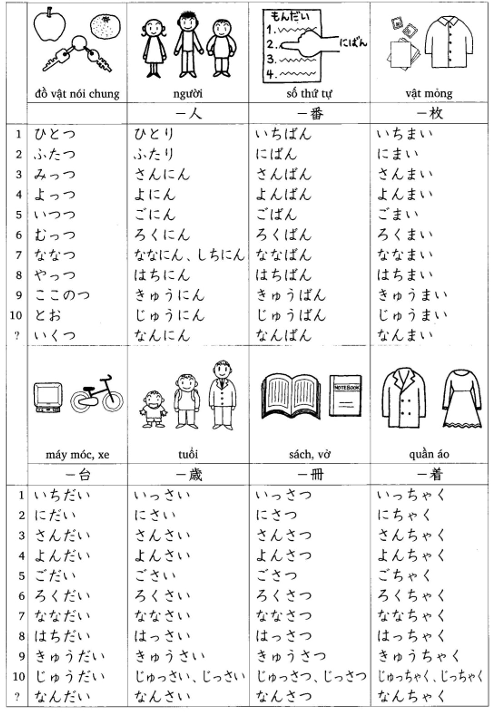
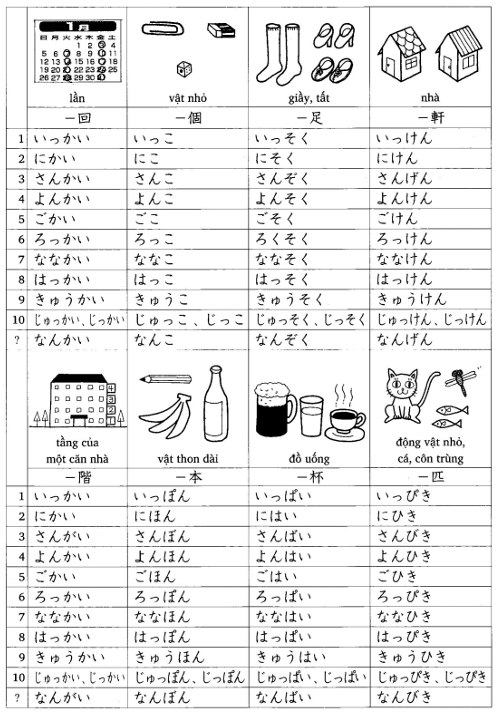

# 11

## 📝 TỪ VỰNG

<table style="width:100%">
  <thead>
    <tr>
      <th>Từ vựng (Kana)</th>
      <th>Ý nghĩa (Nghĩa tiếng Việt)</th>
      <th>Ví dụ (Example)</th>
      <th>Ghi chú (Notes)</th>
    </tr>
  </thead>
  <tbody>
    <tr>
      <td>います </td>
      <td>ở ...</td>
      <td>にほん　に　います <i>ở Nhật</i></td>
      <td></td>
    </tr>
    <tr>
      <td>かかります</td>
      <td>mất, tốn (thời gian, tiền bạc)</td>
      <td></td>
      <td></td>
    </tr>
    <tr>
      <td>やすみます</td>
      <td>nghỉ ngơi</td>
      <td>かいしゃ　を　やすみます <i>Nghỉ làm việc</i></td>
      <td></td>
    </tr>
    <tr>
      <td>ひとつ</td>
      <td>một cái (dùng để đếm đồ vật)</td>
      <td></td>
      <td></td>
    </tr>
    <tr>
      <td>ふたつ</td>
      <td>hai cái</td>
      <td></td>
      <td></td>
    </tr>
    <tr>
      <td>みっつ</td>
      <td>ba cái</td>
      <td></td>
      <td></td>
    </tr>
    <tr>
      <td>よっつ</td>
      <td>bốn cái</td>
      <td></td>
      <td></td>
    </tr>
    <tr>
      <td>いつつ</td>
      <td>năm cái</td>
      <td></td>
      <td></td>
    </tr>
    <tr>
      <td>むっつ</td>
      <td>sáu cái</td>
      <td></td>
      <td></td>
    </tr>
    <tr>
      <td>ななつ</td>
      <td>bảy cái</td>
      <td></td>
      <td></td>
    </tr>
    <tr>
      <td>やっつ</td>
      <td>tám cái</td>
      <td></td>
      <td></td>
    </tr>
    <tr>
      <td>ここのつ</td>
      <td>chín cái</td>
      <td></td>
      <td></td>
    </tr>
    <tr>
      <td>とお</td>
      <td>mười cái</td>
      <td></td>
      <td></td>
    </tr>
    <tr>
      <td>いくつ</td>
      <td>mấy cái, bao nhiêu cái</td>
      <td></td>
      <td></td>
    </tr>
    <tr>
      <td>ひとり</td>
      <td>một người</td>
      <td></td>
      <td></td>
    </tr>
    <tr>
      <td>ふたり</td>
      <td>hai người</td>
      <td></td>
      <td></td>
    </tr>
    <tr>
      <td>ーにん</td>
      <td>ー người</td>
      <td></td>
      <td></td>
    </tr>
    <tr>
      <td>ーだい</td>
      <td>ー cái</td>
      <td></td>
      <td>dùng để đếm máy móc, xe cộ v.v.</td>
    </tr>
    <tr>
      <td>ーまい</td>
      <td>ー tờ, tấm</td>
      <td></td>
      <td>dùng để đếm những vật mỏng như tờ giấy, con tem v.v.</td>
    </tr>
    <tr>
      <td>ーかい</td>
      <td>ー lần</td>
      <td></td>
      <td></td>
    </tr>
    <tr>
      <td>りんご</td>
      <td>táo</td>
      <td></td>
      <td></td>
    </tr>
    <tr>
      <td>みかん</td>
      <td>quýt</td>
      <td></td>
      <td></td>
    </tr>
    <tr>
      <td>サンドイッチ</td>
      <td>bánh san-uých</td>
      <td></td>
      <td></td>
    </tr>
    <tr>
      <td>カレー「ライス」</td>
      <td>món [cơm] cà ri</td>
      <td></td>
      <td></td>
    </tr>
    <tr>
      <td>アイスクリーム</td>
      <td>kem</td>
      <td></td>
      <td></td>
    </tr>
    <tr>
      <td>きって</td>
      <td>tem</td>
      <td></td>
      <td></td>
    </tr>
    <tr>
      <td>はがき</td>
      <td>bưu thiếp</td>
      <td></td>
      <td></td>
    </tr>
    <tr>
      <td>ふうとう</td>
      <td>phong bì</td>
      <td></td>
      <td></td>
    </tr>
    <tr>
      <td>そくたつ</td>
      <td>(bưu phẩm) gửi nhanh</td>
      <td></td>
      <td>Chuyển phát nhanh</td>
    </tr>
    <tr>
      <td>かきとめ</td>
      <td>(bưu phẩm) gửi bảo đảm</td>
      <td></td>
      <td>Chuyển phát an toàn đảm bảo</td>
    </tr>
    <tr>
      <td>エアメール （こうくうびん）</td>
      <td>gửi bằng đường hàng không</td>
      <td></td>
      <td></td>
    </tr>
    <tr>
      <td>ふなびん</td>
      <td>gửi bằng đường biển</td>
      <td></td>
      <td></td>
    </tr>
    <tr>
      <td>りょうしん</td>
      <td>bố mẹ</td>
      <td></td>
      <td></td>
    </tr>
    <tr>
      <td>きょうだい</td>
      <td>anh chị em</td>
      <td></td>
      <td></td>
    </tr>
    <tr>
      <td>あに</td>
      <td>anh trai</td>
      <td></td>
      <td></td>
    </tr>
    <tr>
      <td>おにいさん</td>
      <td>anh trai (dùng cho người khác)</td>
      <td></td>
      <td></td>
    </tr>
    <tr>
      <td>あね</td>
      <td>chị gái</td>
      <td></td>
      <td></td>
    </tr>
    <tr>
      <td>おねえさん</td>
      <td>chị gái (dùng cho người khác)</td>
      <td></td>
      <td></td>
    </tr>
    <tr>
      <td>おとうと</td>
      <td>em trai</td>
      <td></td>
      <td></td>
    </tr>
    <tr>
      <td>おとうとさん</td>
      <td>em trai (dùng cho người khác)</td>
      <td></td>
      <td></td>
    </tr>
    <tr>
      <td>いもうと</td>
      <td>em gái</td>
      <td></td>
      <td></td>
    </tr>
    <tr>
      <td>いもうとさん</td>
      <td>em gái (dùng cho người khác)</td>
      <td></td>
      <td></td>
    </tr>
    <tr>
      <td>がいこく</td>
      <td>nước ngoài</td>
      <td></td>
      <td></td>
    </tr>
    <tr>
      <td>ーじかん</td>
      <td>ー tiếng</td>
      <td></td>
      <td></td>
    </tr>
    <tr>
      <td>ーしゅうかん</td>
      <td>ー tuần</td>
      <td></td>
      <td></td>
    </tr>
    <tr>
      <td>ーかげつ</td>
      <td>ー tháng</td>
      <td></td>
      <td></td>
    </tr>
    <tr>
      <td>ーねん</td>
      <td>ー năm</td>
      <td></td>
      <td></td>
    </tr>
    <tr>
      <td>～ぐらい</td>
      <td>khoảng ~</td>
      <td></td>
      <td></td>
    </tr>
    <tr>
      <td>どのくらい</td>
      <td>bao lâu</td>
      <td></td>
      <td></td>
    </tr>
    <tr>
      <td>ぜんぶで</td>
      <td>tổng cộng</td>
      <td></td>
      <td></td>
    </tr>
    <tr>
      <td>みんな</td>
      <td>tất cả</td>
      <td></td>
      <td></td>
    </tr>
    <tr>
      <td>～だけ</td>
      <td>chỉ ~</td>
      <td></td>
      <td></td>
    </tr>
    <tr>
      <td>いらっしゃいませ。</td>
      <td>Xin mời vào./ Xin chào quý khách.</td>
      <td></td>
      <td>lời chào của người bán hàng đối với khách hàng</td>
    </tr>
    <tr>
      <td>いい「お」てんきですね。</td>
      <td>Trời đẹp nhỉ.</td>
      <td></td>
      <td></td>
    </tr>
    <tr>
      <td>おでかけですか。</td>
      <td>Anh/Chị đi ra ngoài đấy à?</td>
      <td></td>
      <td></td>
    </tr>
    <tr>
      <td>ちょっと　～まで。</td>
      <td>Tôi đi ~ một chút.</td>
      <td></td>
      <td></td>
    </tr>
    <tr>
      <td>いって　いらっしゃい。</td>
      <td>Anh/Chị đi nhé.</td>
      <td></td>
      <td>nguyên nghĩa: Anh/Chị đi rồi lại về nhé.</td>
    </tr>
    <tr>
      <td>いって　まいります。</td>
      <td>Tôi đi đây.</td>
      <td></td>
      <td>nguyên nghĩa: Tôi đi rồi sẽ về.</td>
    </tr>
    <tr>
      <td>それから</td>
      <td>sau đó, tiếp nữa</td>
      <td></td>
      <td></td>
    </tr>
    <tr style="color: red">
      <td>オーストラリア</td>
      <td>Úc</td>
      <td></td>
      <td></td>
    </tr>
  </tbody>
</table>

---
## ✍️ NGỮ PHÁP (Grammar)

### 1. Đếm đồ vật

*   **Giải thích:**
    *   **1) ひとつ、ふたつ……とお:** Cách nói này dùng để đếm đồ vật. Từ 11 trở lên thì chỉ đếm số thôi.
    *   **2) Hậu tố chỉ đơn vị:** Khi đếm người hay vật, hoặc biểu thị số lượng của một đối tượng nào đó chúng ta dùng lượng từ. Hậu tố chỉ đơn vị được đặt ngay sau số từ, và thay đổi tùy theo đối tượng.
        *   **ーにん:** Dùng để đếm người. Một người thì nói là 「ひとり（１にん）」, hai người là 「ふたり（２にん）」, bốn người (４にん) là 「よにん」.
        *   **ーだい:** Dùng để đếm máy móc, và những phương tiện đi lại như ô-tô v.v..
        *   **ーまい:** Dùng để đếm những vật mỏng hoặc phẳng như tờ giấy, áo sơ-mi, đĩa ăn, đĩa CD v.v..
        *   **ーかい:** Dùng để đếm số lần.
        *   **ーふん:** phút
        *   **ーじかん:** tiếng
        *   **ーにち:** ngày (Giống cách nói ngày tháng trừ trường hợp một ngày thì không đọc là 「ついたち」, mà là 「いちにち」).
        *   **ーしゅうかん:** tuần
        *   **ーかげつ:** tháng
        *   **ーねん:** năm
    *   **3) Cách dùng lượng từ:** Khi chữ số đi kèm với hậu tố chỉ đơn vị thì được gọi là lượng từ. Thông thường thì lượng từ được đặt trước động từ mà nó bổ nghĩa, trừ trường hợp của lượng từ chỉ thời gian.
    *   **4) Từ nghi vấn:**
        *   (1) Đối với những vật khi đếm là 「ひとつ、ふたつ、……」, thì dùng **「いくつ」** để hỏi.
        *   (2) Đối với những chữ số có hậu tố chỉ đơn vị đi kèm thì chúng ta dùng **「なん」** để hỏi.
        *   (3) Dùng **「どのくらい」** để hỏi về khoảng thời gian. Có nhiều cách nói đơn vị của thời gian.
    *   **5)「ぐらい/くらい」** được thêm vào sau lượng từ để biểu thị nghĩa là “khoảng”.

*   **Ví dụ:**
    *   *Cách dùng lượng từ:*
      1. りんごを　よっつ　かいました。
            👉 Tôi (đã) mua 4 quả táo.
      2. がいこくじんの　がくせいが　ふたり　います。
            👉 Có hai sinh viên người nước ngoài.
      3. くにで　２かげつ　にほんごを　べんきょうしました。
            👉 Tôi đã học tiếng Nhật 2 tháng ở trong nước.
    *   *Từ nghi vấn:*
      4. みかんを　いくつ　かいましたか。
            👉 Anh/Chị đã mua mấy quả quýt?
             ...やっつ　かいました。
            👉 ...Tôi đã mua 8 quả.
      5. この　かいしゃに　がいこくじんが　なんにん　いますか。
            👉 Ở công ty này có mấy người nước ngoài?
             ...５にん　います。
            👉 ...Có 5 người.
      6. まいばん　なんじかん　にほんごを　べんきょうしますか。
            👉 Hàng tối anh/chị học tiếng Nhật mấy tiếng?
             ...２じかん　べんきょうします。
            👉 ...Tôi học 2 tiếng.
      7. どのくらい　にほんごを　べんきょうしましたか。
            👉 Anh/Chị đã học tiếng Nhật được bao lâu rồi?
             ...３ねん　べんきょうしました。
            👉 ...Tôi đã học được 3 năm.
      8. おおさかから　とうきょうまで　どのくらい　かかりますか。
            👉 Từ Osaka đến Tokyo mất bao lâu?
             ...しんかんせんで　２じかんはん　かかります。
            👉 ...Mất 2 tiếng rưỡi đi bằng tàu Shinkansen.
    *   *ぐらい:*
      9. がっこうに　せんせいが　３０にんぐらい　います。
            👉 Ở trường học có khoảng 30 giáo viên.
      10. １５ふんぐらい　かかります。
            👉 Mất khoảng 15 phút.

---

### 2. Lượng từ (chỉ khoảng thời gian) に　ーかい Động từ

*   **Giải thích:** Cách nói này dùng để biểu thị tần số khi làm một việc gì đó.

*   **Ví dụ:**
    1. １かげつに　２かい　えいがを　みます。
        👉 Một tháng tôi xem phim 2 lần.

---

### 3. Lượng từ だけ ／ Danh từ だけ

*   **Giải thích:「だけ」** (chỉ, thôi) được đặt sau lượng từ hoặc danh từ để biểu thị ý nghĩa là “không nhiều hơn thế” hoặc “ngoài ra không có cái khác”.

*   **Ví dụ:**
    1. パワーでんきに　がいこくじんの　しゃいんが　ひとりだけ　います。
        👉 Công ty Điện Power chỉ có một nhân viên người nước ngoài.
    2. やすみは　にちようびだけです。
        👉 Ngày nghỉ của tôi chỉ có chủ nhật thôi.

---

### 4. Bảng số đếm

