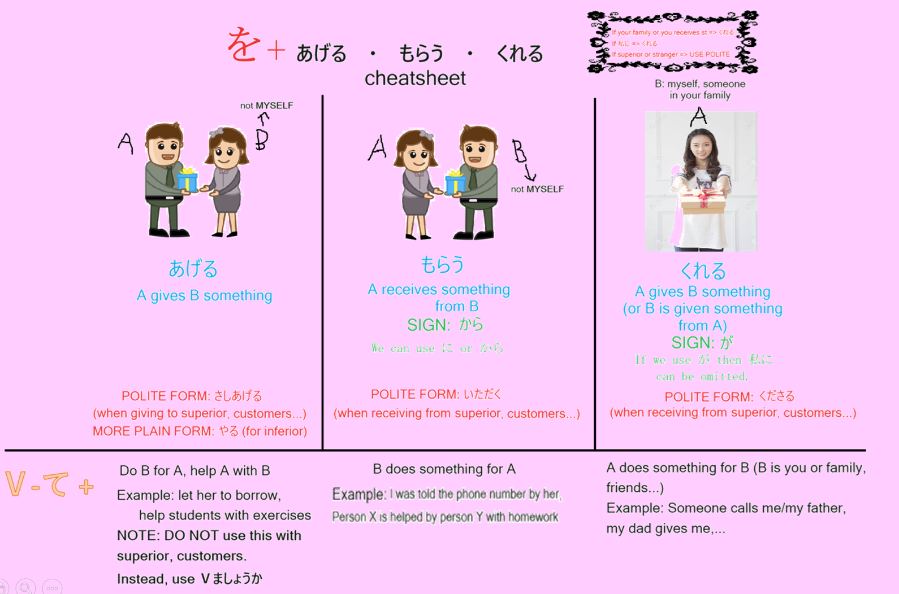

# 24

## 📝 TỪ VỰNG

<table style="width:100%">
  <thead>
    <tr>
      <th>Từ vựng (Kanji/Kana)</th>
      <th>Ý nghĩa (Nghĩa tiếng Việt)</th>
      <th>Ví dụ (Example)</th>
      <th>Ghi chú (Notes)</th>
    </tr>
  </thead>
  <tbody>
    <tr>
      <td>くれます</td>
      <td>cho, tặng (tôi)</td>
      <td></td>
      <td></td>
    </tr>
    <tr>
      <td>つれて 行きます</td>
      <td>dẫn đi</td>
      <td></td>
      <td></td>
    </tr>
    <tr>
      <td>つれて 来ます</td>
      <td>dẫn đến</td>
      <td></td>
      <td></td>
    </tr>
    <tr>
      <td>おくります</td>
      <td>đưa đi, đưa đến, tiễn</td>
      <td>ひと を おくります <i>Tiễn một ai đó</i></td>
      <td></td>
    </tr>
    <tr>
      <td>しょうかいします</td>
      <td>giới thiệu</td>
      <td></td>
      <td></td>
    </tr>
    <tr>
      <td>あんないします</td>
      <td>hướng dẫn, giới thiệu, dẫn đường</td>
      <td></td>
      <td></td>
    </tr>
    <tr>
      <td>せつめいします</td>
      <td>giải thích, trình bày</td>
      <td></td>
      <td></td>
    </tr>
    <tr>
      <td>いれます</td>
      <td>pha [cà-phê]</td>
      <td>コーヒー を いれます <i>Pha cà phê</i></td>
      <td></td>
    </tr>
    <tr>
      <td>おじいさん／おじいちゃん</td>
      <td>ông nội, ông ngoại, ông</td>
      <td></td>
      <td></td>
    </tr>
    <tr>
      <td>おばあさん／おばあちゃん</td>
      <td>bà nội, bà ngoại, bà</td>
      <td></td>
      <td></td>
    </tr>
    <tr>
      <td>じゅんび</td>
      <td>chuẩn bị</td>
      <td>じゅんび を します <i>Chuẩn bị</i></td>
      <td></td>
    </tr>
    <tr>
      <td>いみ</td>
      <td>ý nghĩa</td>
      <td></td>
      <td></td>
    </tr>
    <tr>
      <td>「お」かし</td>
      <td>bánh kẹo</td>
      <td></td>
      <td></td>
    </tr>
    <tr>
      <td>ぜんぶ</td>
      <td>toàn bộ, tất cả</td>
      <td></td>
      <td></td>
    </tr>
    <tr>
      <td>じぶんで</td>
      <td>tự (mình)</td>
      <td></td>
      <td></td>
    </tr>
    <tr>
      <td>ほかに</td>
      <td>ngoài ra, bên cạnh đó</td>
      <td></td>
      <td></td>
    </tr>
    <tr>
      <td>ワゴンしゃ</td>
      <td>xe ô-tô kiểu wagon</td>
      <td></td>
      <td>Có thùng đóng kín</td>
    </tr>
    <tr>
      <td>「お」べんとう</td>
      <td>cơm hộp</td>
      <td></td>
      <td></td>
    </tr>
    <tr>
      <td>母の日　(はは の ひ)</td>
      <td>Ngày Mẹ</td>
      <td></td>
      <td></td>
    </tr>
  </tbody>
</table>

---
## ✍️ NGỮ PHÁP (Grammar)
### 1. くれます

*   **Giải thích:**
    *   Chúng ta đã học về động từ 「あげます」 với nghĩa là cho, tặng. Nhưng trong trường hợp người nhận là **người nói** hoặc là **thành viên trong gia đình của người nói** thì động từ này không thể dùng được, mà thay vào đó chúng ta dùng động từ **「くれます」**.

*   **Ví dụ:**
    1. わたしは　さとうさんに　はなを　あげました。
        👉 Tôi đã tặng hoa cho chị Sato.
    2. さとうさんは　わたしに　クリスマスカードを　くれました。
        👉 Chị Sato đã tặng tôi thiếp mừng Giáng sinh.
    3. さとうさんは　いもうとに　おかしを　くれました。
        👉 Chị Sato đã cho em gái tôi bánh kẹo.

---

### 2. Động từ thể て + あげます / もらいます / くれます

*   **Giải thích:**
    *   Các động từ này được dùng kèm với động từ thể て để biểu thị một cách rõ ràng việc ai đó làm một cái gì cho ai, đồng thời cũng biểu thị lòng tốt hoặc sự cám ơn.
    *   **1) Động từ thể て あげます:** Biểu thị việc một người nào đó làm một việc tốt cho ai đó với thiện ý. Tuy nhiên, nên **tránh dùng với người trên** vì có thể gây ấn tượng "khoe khoang". Với người chưa thân hoặc người trên, nên dùng 「～ましょうか」
    *   **2) Động từ thể て もらいます:** Biểu thị sự biết ơn của bên tiếp nhận hành vi tốt.
    *   **3) Động từ thể て くれます:** Giống như 「て もらいます」, mẫu câu này biểu thị sự biết ơn. Điểm khác là ở mẫu câu này chủ ngữ là đối tượng thực hiện hành vi tốt.

*   **Ví dụ:**
    1. わたしは　きむらさんに　ほんを　かして　あげました。
        👉 Tôi cho chị Kimura mượn sách.
    2. タクシーを　よびましょうか。
        👉 Tôi gọi taxi cho anh/chị nhé. (Bài 14)
    3. てつだいましょうか。
        👉 Tôi giúp anh/chị nhé. (Bài 14)
    4. わたしは　やまださんに　としょかんの　でんわばんごうを　おしえて　もらいました。
        👉 Tôi (đã) được anh/chị Yamada cho biết số điện thoại của thư viện.
    5. ははは　［わたしに］　セーターを　おくって　くれました。
        👉 Mẹ gửi [cho tôi] một cái áo len.

*   **Bảng tổng hợp:**

---

### 3. Danh từ (người) が Động từ

*   **Giải thích:** Khi người nói **bổ sung thêm thông tin mới** về một chủ đề vừa được nhắc tới, thì chủ ngữ mang thông tin mới đó được dùng kèm với trợ từ **「が」**.

*   **Ví dụ:**
    1. すてきな　ネクタイですね。👉 Cái cà-vạt đẹp nhỉ.
         ...ええ、さとうさんが　くれました。👉 Vâng, chị Sato tặng tôi đấy ạ.

---

### 4. Từ nghi vấn が Động từ

*   **Giải thích:**: Khi từ nghi vấn là chủ ngữ thì dùng が.

*   **Ví dụ:**
    1. だれが　てつだいに　いきますか。👉 Ai sẽ đi để giúp? 
         ...カリーナさんが　いきます。👉 Chị Karina sẽ đi.